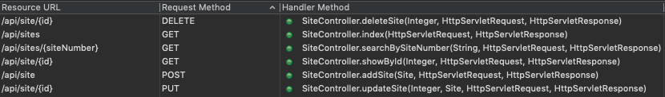
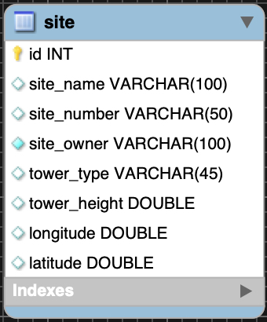
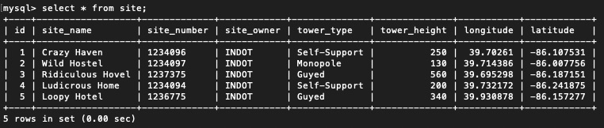

## RESTful Services Event Tracker
Weeks 12 and 13, Individual Project for Skill Distillery


*Cell Site Log*

[Hosted live on AWS ](http://caseyasher.info/apps/EventTracker/api/sites) (Get all sites api) Week 12 Weekend HW

[Hosted live on AWS ](http://caseyasher.info/apps/EventTracker/) (Angular front-end) Week 13 Weekend HW


### Overview
This simple REST API is the foundational backend for a Cell Site Log implementing Angular for a frontend.


Feel free to play around with the routes below.

Example JSON
```
{
    "id": 3,
    "siteName": "Ridiculous Hovel",
    "siteNumber": "1237375",
    "siteOwner": "INDOT",
    "towerType": "Guyed",
    "towerHeight": 560.0,
    "longitude": 39.695298,
    "latitude": -86.187151
}
```
REST Route URIs


#### Usage
*Get all sites*
```
GET http://3.13.155.249:8080/EventTracker/api/sites
```
*Get site by ID*
```
GET http://3.13.155.249:8080/EventTracker/api/site/{id}
```
*Get List of sites by Site Number*
```
GET http://3.13.155.249:8080/EventTracker/api/site/{siteNumber}
```
*Add site* (JSON needed)
```
POST http://3.13.155.249:8080/EventTracker/api/site
```
*Update site* (JSON needed)
```
PUT http://3.13.155.249:8080/EventTracker/api/site/{id}
```
*Delete site* (primary key as ID)
```
DELETE http://3.13.155.249:8080/EventTracker/api/site/{id}
```

Database Structure  

  

Default Inserts  



### Technologies Used
* Spring Boot, Spring REST, Spring Tool Suite
* MySql, MySql Workbench
* Java, JPARepository
* Angular
* Git / Github
